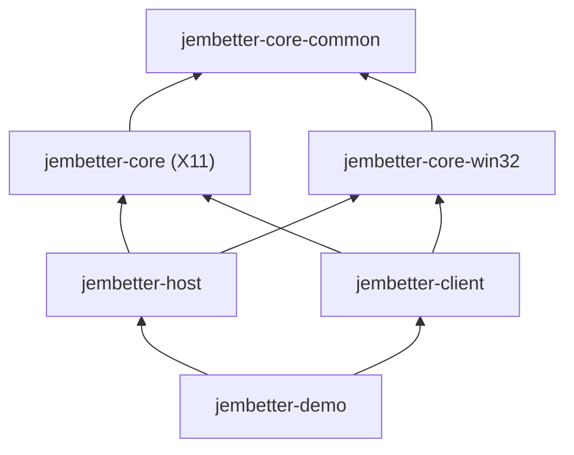

# Architecture

## Modules

- **`jembetter-core-common`** — platform-independent, JNA-free code shared by
  both sides (the rendezvous handshake, AWT `Canvas`-to-native-handle
  extraction, `os.name` dispatch). Not meant to be depended on directly.
- **`jembetter-core`** — X11 native bindings (via JNA) and the XEmbed protocol
  implementation shared by both sides. Not meant to be depended on directly.
- **`jembetter-core-win32`** — Win32 native bindings (via JNA) mirroring
  `jembetter-core`'s X11 primitives 1:1. Backs `jembetter-host`/`jembetter-client`'s
  Win32 implementations — see [Win32 backend status](win32-status.md).
- **`jembetter-host`** — embedder-side API: `EmbedHost` (quick start, a 1:1
  facade for embedding a single self-spawned client) and `EmbedSocket`
  (advanced — multi-client, socket rendezvous) both host another process's
  window inside your own Swing UI.
- **`jembetter-client`** — client-side API: `EmbedPlug` (quick start) and
  `EmbedClient` (advanced) both make your own process's top-level window
  embeddable by a host.
- **`jembetter-demo`** — runnable demo pairs demonstrating the whole pipeline
  end to end, one per API layer; see [Try the demo](../README.md#try-the-demo)
  in the main README.

A host process depends on `jembetter-host`; a client process depends on
`jembetter-client`. A process that's neither (e.g. the demo module) can depend
on both.

## Module dependencies

`jembetter-core`/`jembetter-core-win32` sit side by side rather than behind a
shared abstraction: they mirror each other's primitives 1:1
(`WindowFinder`↔`Win32WindowFinder`, `Reparenting`↔`Win32Reparent`, …), and
`EmbedHost`/`EmbedPlug` pick between `EmbedHostX11`/`EmbedHostWin32` (resp.
`EmbedPlugX11`/`EmbedPlugWin32`) by `os.name` at runtime rather than through a
common interface — see [Win32 backend status](win32-status.md) for why (some
primitives, like `Win32ClickWatcher`, have no X11 equivalent to mirror at
all).
